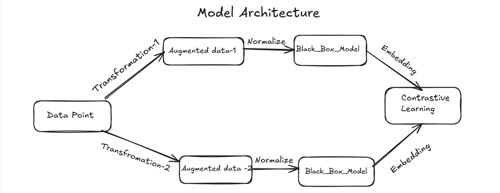
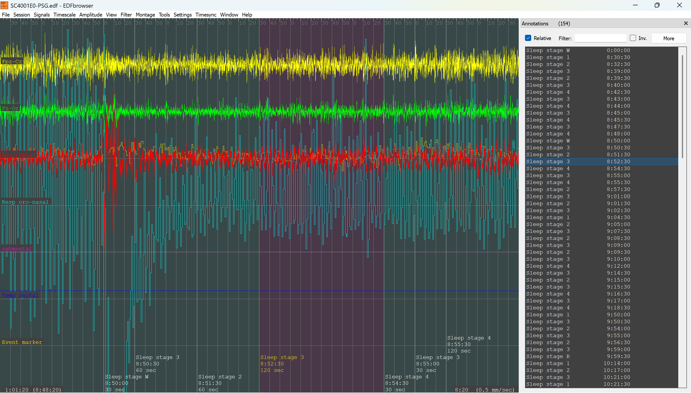

# Designing a Multimodal Foundation Model for Sleep Apnea Detection and Sleep Stage Classification

## Overview

This repository contains the research work carried out under Prof. Nipun Batra as part of the Summer Research Internship at Sustainability Labs, IIT Gandhinagar.

The project aims to build a self-supervised multimodal foundation model capable of:

- Sleep Stage Classification
- Sleep Apnea Detection
- Hypopnea Detection

using physiological signals obtained from overnight polysomnography (PSG) recordings.

---

## Motivation

Manual sleep scoring is a challenging and time-consuming task requiring experts to annotate approximately 1000 sleep epochs per patient.

Large amounts of unlabeled physiological data are available, while labeled data is expensive and difficult to obtain.

This project investigates whether self-supervised contrastive learning can learn useful representations from unlabeled data and significantly reduce labeling requirements.

---

## Contrastive Learning Framework

For each sample:

1. Generate two augmented views.
2. Pass both views through a shared encoder.
3. Learn embeddings using InfoNCE / NT-Xent loss.
4. Fine-tune using a small amount of labeled data.
5. Perform downstream classification.

<p align="center">
  
</p>

---

## Datasets

### MNIST

- Grayscale handwritten digits
- Single-channel images
- 2D CNN encoder

### CIFAR-10

- RGB natural images
- ResNet encoder
- SimCLR-based contrastive learning

### UCI-HAR

- Human Activity Recognition
- Multivariate time-series data
- 1D CNN + ResNet encoder

### Sleep-EDF

Polysomnography recordings containing:

- EEG Fpz-Cz
- EEG Pz-Oz
- EOG
- EMG
- Respiratory signals
- Event markers

Current experiments use:

- EEG Fpz-Cz
- EEG Pz-Oz
- EMG Submental

---

## Sleep-EDF Signals

<p align="center">
  
</p>

<p align="center">
  <em>Sample PSG signals from the Sleep-EDF dataset.</em>
</p>

---

## Results

### Contrastive Learning Performance

| Dataset | Accuracy |
|----------|----------|
| MNIST | 97% |
| CIFAR-10 | 80–85% |
| UCI-HAR | 95–97% |

### Sleep-EDF

| Method | Accuracy |
|----------|----------|
| Supervised (100% labels) | 91% |
| Contrastive Learning + Fine-tuning | 88% |
| Supervised (10% labels) | 86% |

These results demonstrate that self-supervised pretraining achieves performance close to fully supervised models while using significantly fewer labeled samples.

---

## Key Findings

- Contrastive learning generalizes across images and time-series modalities.
- Pretrained encoders substantially improve performance when labeled data is scarce.
- Learned embeddings exhibit meaningful clustering in PCA visualizations.
- Self-supervised learning is highly promising for medical signal analysis.

---

## Repository Structure

```text
.
├── MNIST.ipynb
├── CIFAR.ipynb
├── uci_har.ipynb
├── sleep_edf.ipynb
├── edf_contrastive.ipynb
├── edf_supervised.ipynb
├── edf_supervised_10.ipynb
├── Architecture.png
├── images/
│   └── sleed_edf_signals.png
└── README.md
```

---

## Research Progress

### Week 1

- Studied SleepFM and Stanford Sleep Bench papers.
- Learned:
  - RNNs
  - LSTMs
  - Encoder-Decoder Architectures
  - Attention Mechanisms
  - Transformers

### Week 2

- Learned contrastive learning techniques.
- Implemented SimCLR-style pipelines on:
  - MNIST
  - CIFAR-10
  - UCI-HAR

### Week 3

- Applied contrastive learning to Sleep-EDF.
- Trained models on remote compute servers.

---

## Future Work

- Multimodal representation learning using EEG, EOG, EMG and respiratory channels.
- Large-scale sleep foundation model pretraining.
- Fine-tuning on clinical sleep datasets from AIIMS Delhi.
- Automated sleep stage scoring.
- Obstructive sleep apnea and hypopnea detection.

---

## Author

**Gella Naga Sai Krishna**  
B.Tech, Computer Science and Engineering  
Indian Institute of Technology Gandhinagar

### Research Interests

- Self-Supervised Learning
- Contrastive Learning
- Representation Learning
- Healthcare AI
- Foundation Models
- Sleep Analysis

---

## Acknowledgements

This work was conducted under the guidance of Prof. Nipun Batra at Sustainability Labs, IIT Gandhinagar.
